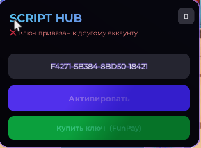
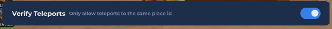
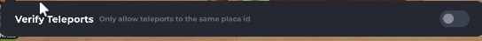
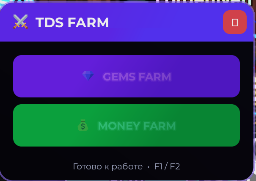
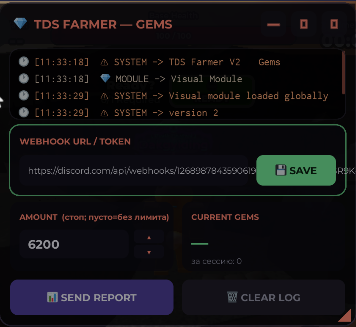

# TDS Farmer V2 — Script Hub

Автофарм для **Tower Defense Simulator (Roblox)**. Скрипт умеет фармить **гемы (Gems)** и **деньги (Money)**, ведёт лог работы, считает нафармленное за сессию и умеет отправлять отчёты в Discord через вебхук.

---

## 📋 Возможности

- 💎 **GEMS FARM** — автоматический фарм гемов
- 💰 **MONEY FARM** — автоматический фарм денег
- 📊 Счётчик нафармленного за сессию (Current Gems)
- 🔔 Отчёты в Discord через **Webhook**
- 🎯 Лимит фарма (**AMOUNT**) — скрипт остановится, когда достигнет заданного значения
- ⌨️ Горячие клавиши **F1 / F2** для управления
- 📝 Встроенный лог всех действий скрипта

---

## ⚙️ Требования

1. Windows + Roblox
2. Рабочий экзекутор (инжектор скриптов)
3. Активный **ключ** (приобретается на FunPay)

---

## 🔑 Шаг 1. Активация ключа

После запуска скрипта откроется окно **SCRIPT HUB**:

1. Вставьте ваш ключ в поле (формат: `XXXXX-XXXXX-XXXXX-XXXXX`).
2. Нажмите **«Активировать»**.
3. Если ключа нет — нажмите **«Купить ключ (FunPay)»**.

> ⚠️ **«Ключ привязан к другому аккаунту»** — эта ошибка означает, что ключ уже был активирован на другом аккаунте. Один ключ работает только на одном аккаунте. Используйте тот аккаунт, на котором ключ активировался впервые, либо приобретите новый ключ.

---

## 🛠️ Шаг 2. Настройка экзекутора (Verify Teleports)

Скрипт использует телепорты между лобби и игровыми серверами, поэтому в настройках экзекутора нужно **отключить** опцию **Verify Teleports**.

❌ **Неправильно** — Verify Teleports включён, скрипт не сможет заходить в матчи:

✅ **Правильно** — Verify Teleports выключен:

---

## 🚜 Шаг 3. Выбор режима фарма

После активации ключа откроется главное меню **TDS FARM**:

- 💎 **GEMS FARM** — запуск фарма гемов
- 💰 **MONEY FARM** — запуск фарма денег

Внизу окна отображается статус **«Готово к работе»** и горячие клавиши **F1 / F2** — ими можно управлять скриптом с клавиатуры (F1 — Gems Farm, F2 — Money Farm).

---

## 📊 Шаг 4. Панель фарма и настройка отчётов

После выбора режима откроется рабочая панель (на примере — **TDS FARMER — GEMS**):

### Элементы панели

| Элемент | Описание |
|---|---|
| **Лог** | Журнал работы скрипта: загрузка модулей, версия, события |
| **WEBHOOK URL / TOKEN** | Ссылка на ваш Discord-вебхук для отчётов. Вставьте её и нажмите **SAVE** |
| **AMOUNT** | Лимит фарма (стоп-значение). Скрипт остановится, когда счётчик достигнет этого числа. **Пусто = без лимита** |
| **CURRENT GEMS** | Текущее количество валюты и сколько нафармлено за сессию |
| **SEND REPORT** | Отправить отчёт в Discord вручную |
| **CLEAR LOG** | Очистить лог |

### Как получить Discord Webhook

1. В своём Discord-сервере откройте: **Настройки канала → Интеграции → Вебхуки → Новый вебхук**.
2. Нажмите **«Копировать URL вебхука»**.
3. Вставьте ссылку в поле **WEBHOOK URL / TOKEN** и нажмите **SAVE**.

> Ссылка вебхука выглядит так: `https://discord.com/api/webhooks/...` — никому её не передавайте.

---

## ❓ Частые вопросы

**Скрипт не заходит в матчи / застревает в лобби.**
Проверьте, что **Verify Teleports выключен** в настройках экзекутора (см. Шаг 2).

**Пишет «Ключ привязан к другому аккаунту».**
Ключ одноразово привязывается к аккаунту при первой активации. Зайдите с того аккаунта, где ключ был активирован, или купите новый.

**Как остановить фарм на нужном количестве?**
Укажите число в поле **AMOUNT** — при достижении этого значения скрипт остановится. Если поле пустое, фарм идёт без лимита.

**Отчёты не приходят в Discord.**
Проверьте, что ссылка вебхука скопирована полностью и после вставки нажата кнопка **SAVE**. Проверить отправку можно кнопкой **SEND REPORT**.

---

## ⚠️ Дисклеймер

Скрипт предназначен для ознакомительных целей. Использование сторонних скриптов нарушает условия использования Roblox и может привести к блокировке аккаунта. Используйте на свой страх и риск.
