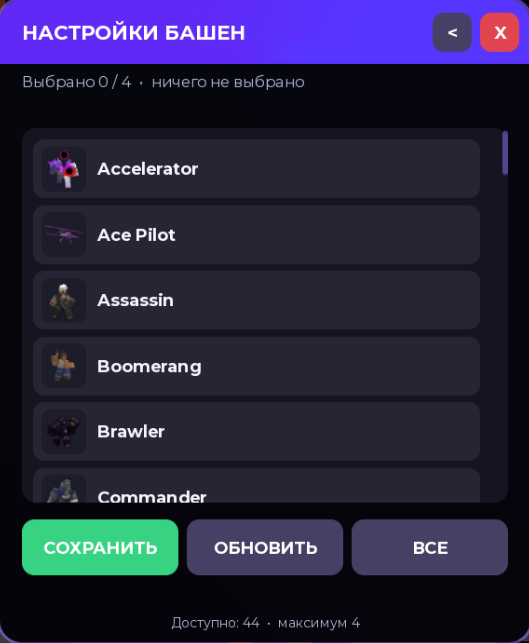
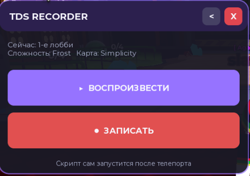
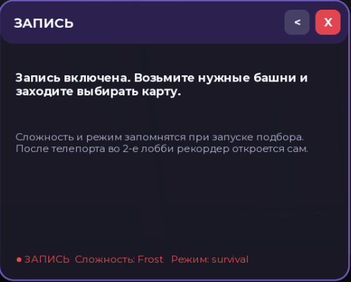
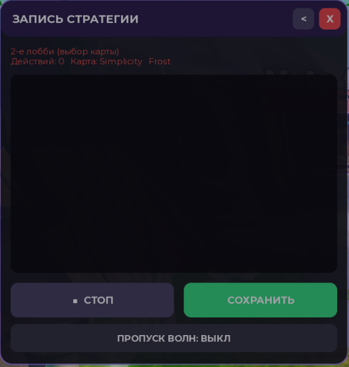
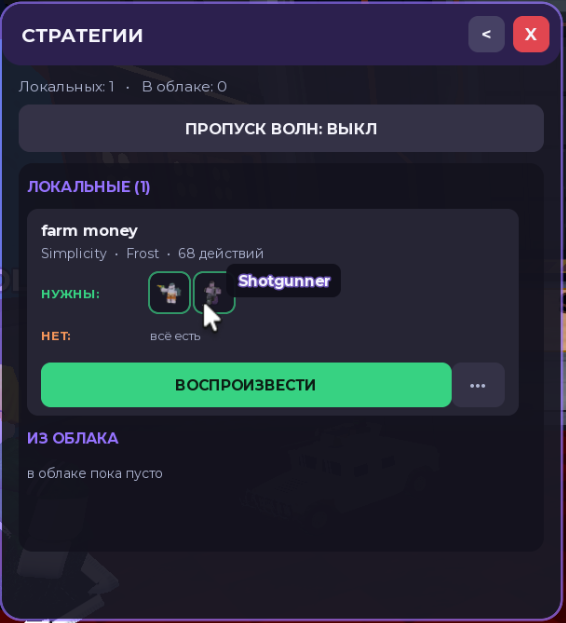
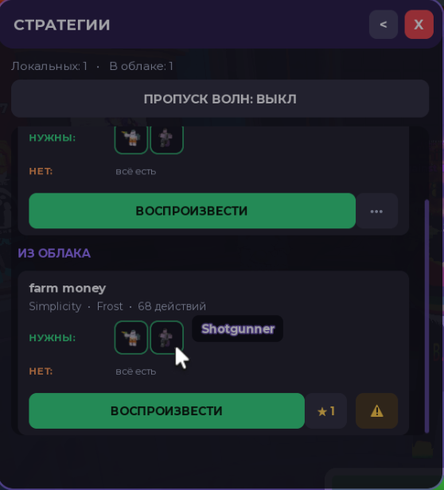

<h1 align="center">TDS Farmer V2 — Script Hub</h1>

  Автофарм для <b>Tower Defense Simulator (Roblox)</b>: 
  фармит <b>гемы</b> и <b>деньги</b>, шлёт отчёты в Discord, 
  а с версии V2 умеет <b>записывать и повторять твои стратегии</b>.

  
  
  

  

---

## 📑 Содержание

| Раздел | О чём |
|---|---|
| [Возможности](#vozmozhnosti) | что умеет скрипт |
| [Требования](#trebovaniya) | что нужно до запуска |
| [Шаг 1. Ключ](#klyuch) | активация |
| [Шаг 2. Экзекутор](#executor) | Verify Teleports |
| [Шаг 3. Меню](#menu) | выбор режима |
| [Шаг 4. Башни](#towers) | какие башни берёт скрипт |
| [Панель фарма](#panel) | лог, вебхук, лимит |
| [RECORDER](#recorder) | запись и повтор стратегий |
| [Частые вопросы](#faq) | что делать, если не работает |

---

## 📋 Возможности

| | Режим | Что делает |
|:--:|---|---|
| 💎 | **GEMS FARM** | автоматический фарм гемов |
| 💰 | **MONEY FARM** | автоматический фарм денег |
| 🔴 | **RECORDER** `BETA` | записывает твою игру и повторяет её матч за матчем |

**Общее для всех режимов**

- 📊 счётчик нафармленного за сессию
- 🔔 отчёты в Discord через **Webhook**
- 🎯 лимит фарма (**AMOUNT**) — скрипт сам остановится на нужном числе
- ⌨️ горячие клавиши **F1 / F2**
- 📝 встроенный лог всех действий
- 🔄 переживает телепорты между лобби и матчами

---

## ⚙️ Требования

1. Windows + Roblox
2. Рабочий экзекутор (инжектор скриптов)
3. Активный **ключ** — [купить на FunPay](https://funpay.com/users/6883431/)

> [!NOTE]
> Один ключ работает на одном аккаунте Roblox: при первой активации он к нему привязывается.

---

## 🔑 Шаг 1. Активация ключа

После запуска скрипта откроется окно **SCRIPT HUB**.

  

1. Вставь ключ в поле — формат `XXXXX-XXXXX-XXXXX-XXXXX`
2. Нажми **«Активировать»**
3. Ключа нет — жми **«Купить ключ (FunPay)»**

> [!WARNING]
> **«Ключ привязан к другому аккаунту»** — ключ уже активирован на другом профиле. Зайди с того аккаунта, где активировал впервые, либо возьми новый ключ.

---

## 🛠️ Шаг 2. Настройка экзекутора

Скрипт постоянно телепортируется между лобби и матчами, поэтому в экзекуторе нужно **выключить** опцию **Verify Teleports**. Иначе скрипт застрянет в лобби.

<table>
<tr>
<td align="center"><b>❌ Неправильно</b> Verify Teleports включён</td>
<td align="center"><b>✅ Правильно</b> Verify Teleports выключен</td>
</tr>
<tr>
<td></td>
<td></td>
</tr>
</table>

---

## 🚜 Шаг 3. Главное меню

После активации откроется меню **TDS FARM**.

  

| Кнопка | Что делает |
|---|---|
| **GEMS FARM** | запускает фарм гемов (клавиша `F1`) |
| **MONEY FARM** | запускает фарм денег (клавиша `F2`) |
| **RECORDER (BETA)** | открывает рекордер стратегий |
| ⚙️ (шестерёнка) | выбор башен, которые скрипт берёт в лобби |

Внизу окна — статус: **«Готово к работе»** либо список выбранных башен.

---

## 🗼 Шаг 4. Выбор башен

Шестерёнка в заголовке открывает **НАСТРОЙКИ БАШЕН**. Здесь отмечаются башни, которые скрипт экипирует перед матчем.

  

| Кнопка | Что делает |
|---|---|
| **СОХРАНИТЬ** | запомнить выбор (максимум **4** башни — столько слотов в игре) |
| **ОБНОВИТЬ** | перечитать инвентарь, если список пустой или устарел |
| **ВСЕ** | показать вообще все башни игры, а не только твои |

> [!TIP]
> Список пуст или не сходится с игрой — открой в Roblox вкладку с башнями и нажми **ОБНОВИТЬ**. Если не помогло, кнопка **ПЕРЕЗАЙТИ В ИГРУ** сделает перезаход на сервер.

---

## 📊 Панель фарма и отчёты в Discord

После запуска режима откроется рабочая панель (на примере — **TDS FARMER — GEMS**).

  

| Элемент | Описание |
|---|---|
| **Лог** | журнал работы: загрузка модулей, версия, события матчей |
| **WEBHOOK URL / TOKEN** | ссылка на Discord-вебхук. Вставь и нажми **SAVE** |
| **AMOUNT** | стоп-значение. Скрипт остановится, когда наберёт это число. **Пусто = без лимита** |
| **CURRENT GEMS** | текущий баланс и сколько нафармлено за сессию |
| **SEND REPORT** | отправить отчёт в Discord вручную |
| **CLEAR LOG** | очистить лог |

<b>Как получить ссылку вебхука Discord</b>

 

1. В своём Discord-сервере: **Настройки канала → Интеграции → Вебхуки → Новый вебхук**
2. Нажми **«Копировать URL вебхука»**
3. Вставь в поле **WEBHOOK URL / TOKEN** и нажми **SAVE**

Ссылка выглядит так: `https://discord.com/api/webhooks/...`

> [!CAUTION]
> Никому не давай эту ссылку — по ней можно писать в твой канал.

---

## 🔴 RECORDER (BETA) — свои стратегии

Рекордер записывает **всё, что ты делаешь в матче**, а потом повторяет это сам — матч за матчем, бесконечно, пока не остановишь или пока не наберётся лимит из панели фарма.

  

В шапке видно, где ты сейчас (лобби или матч), какая сложность и карта запомнены.

**Что попадает в запись**

| Действие | Записывается |
|---|---|
| 🗼 постановка башни | место, поворот, номер башни |
| ⬆️ апгрейд | номер башни, путь, цена |
| 💰 продажа | номер башни |
| ✨ способность | номер башни и название |
| 🎯 смена цели | First / Last / Strongest и прочее |
| ⚙️ настройки башни | Flight Path, Unit 1 и другие списки |
| ⏩ скип волны | только если волна реально пропущена |

Вместе с действием запоминается **волна и секунда внутри неё** — при повторе всё выполняется в том же темпе.

---

### ● Запись стратегии

**1. Включи запись в 1-м лобби**

Открой рекордер и нажми **ЗАПИСАТЬ**.

  

Дальше просто играй как обычно: возьми нужные башни и запусти поиск игры. Сложность и режим запомнятся сами, а после телепорта во 2-е лобби рекордер **откроется заново сам**.

> [!NOTE]
> Передумал? Кнопка **`<`** снимает запись. Если ничего записать не успел, следов не останется.

**2. Выбери карту и играй**

Во 2-м лобби и в матче открывается консоль записи: каждое действие появляется в логе сразу.

  

| Кнопка | Что делает |
|---|---|
| **СТОП** | приостановить запись |
| **СОХРАНИТЬ** | ввести название и сохранить стратегию |
| **ПРОПУСК ВОЛН** | автоскип волн — матч идёт быстрее |

> [!TIP]
> Время **перед первой волной** («--» в счётчике) не идёт: расставляй башни спокойно, порядок сохранится, а волна стартует только когда всё готово.

**3. Сохрани**

Нажми **СОХРАНИТЬ**, введи название — стратегия ляжет в память экзекутора. Дальше её можно выложить **В ОБЛАКО**, чтобы она стала доступна другим владельцам ключей.

---

### ▶ Воспроизведение

Кнопка **ВОСПРОИЗВЕСТИ** в главном окне открывает список стратегий.

  

В карточке видно карту, сложность, число действий и башни:

- <b>НУЖНЫ</b> — башни, которые есть у тебя;
- <b>НЕТ</b> — которых не хватает. Наведи курсор на иконку — покажется название.

> [!WARNING]
> Если каких-то башен нет, стратегия отыграется криво: пропущенные башни сдвинут нумерацию, и апгрейды уйдут не туда.

**Что делает скрипт при запуске**

1. берёт башни стратегии в 1-м лобби и запускает подбор с той же сложностью и режимом;
2. во 2-м лобби голосует за нужную карту (нет на досках — вето и заход заново);
3. на карте показывает **призраков** — полупрозрачные модели будущих башен с номерами, поставленная башня гасит своего призрака;
4. повторяет все действия по волнам и секундам;
5. дожидается исхода матча, шлёт отчёт в Discord и начинает круг заново.

Не хватает денег на башню — скрипт **ждёт, пока накопится**, и ставит её, как только хватит. Матч кончился досрочным поражением — прогон это видит и уходит на следующий круг.

Во время прогона окно сворачивается в маленькую кнопку **СТОП**, а весь ход пишется в консоль: зелёным — что получилось, красным — что нет.

---

### ☁️ Облако стратегий

Раздел **ИЗ ОБЛАКА** — стратегии других владельцев ключей.

  

| Кнопка | Что делает |
|:--:|---|
| **ВОСПРОИЗВЕСТИ** | скачать и запустить стратегию |
| ⭐ | оценить. Повторное нажатие снимает голос |
| ⚠️ | пожаловаться на стратегию (нажать **дважды** — защита от случайного клика) |
| **•••** | у своих стратегий: удалить или выложить в облако |

Жалобы видит автор скрипта: если на стратегию жалуются, её проверят и уберут из общего доступа.

---

## ❓ Частые вопросы

<b>Скрипт не заходит в матчи, застревает в лобби</b>

 

Проверь, что **Verify Teleports выключен** в настройках экзекутора (см. [Шаг 2](#executor)). Иногда дополнительно помогает VPN.

<b>«Ключ привязан к другому аккаунту»</b>

 

Ключ привязывается к аккаунту при первой активации. Зайди с того аккаунта, где активировал, либо возьми новый ключ.

<b>Как остановить фарм на нужном количестве?</b>

 

Впиши число в поле **AMOUNT**. Пустое поле — фарм без лимита.

<b>Отчёты не приходят в Discord</b>

 

Проверь, что ссылка вебхука скопирована целиком и после вставки нажата **SAVE**. Проверить отправку — кнопкой **SEND REPORT**.

<b>Список башен пустой</b>

 

Открой в игре вкладку с башнями (инвентарь) и нажми **ОБНОВИТЬ**. Если не помогло — **ПЕРЕЗАЙТИ В ИГРУ**.

<b>Рекордер не записывает действия</b>

 

Если в окне записи написано «Перехват действий недоступен в этом экзекуторе» — твой экзекутор не умеет перехватывать вызовы игры. Воспроизведение чужих стратегий при этом работает.

<b>При повторе башня не встаёт</b>

 

Две причины, обе видно в логе:

- **не хватает денег** — скрипт подождёт и поставит сам;
- **место занято** — обычно мешает башня другого игрока. Скрипт попробует несколько раз и пойдёт дальше.

---

## ⚠️ Дисклеймер

Скрипт предназначен для ознакомительных целей. Использование сторонних скриптов нарушает условия использования Roblox и может привести к блокировке аккаунта. Используешь на свой страх и риск.

  TDS Farmer V2 · <a href="https://funpay.com/users/6883431/">купить ключ</a>

