<h1 align="center">TDS Farmer V2 — Script Hub</h1>

  Автофарм для <b>Tower Defense Simulator (Roblox)</b>: 
  фармит <b>гемы</b> и <b>деньги</b>, шлёт отчёты в Discord, 
  а ещё <b>записывает и повторяет твои стратегии</b>.

  
  
  

  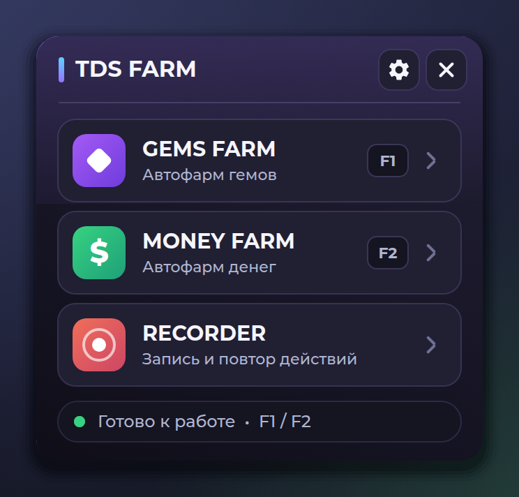

---

## 📑 Содержание

| Раздел | О чём |
|---|---|
| [Возможности](#vozmozhnosti) | что умеет скрипт |
| [Требования](#trebovaniya) | что нужно до запуска |
| [Шаг 1. Ключ](#klyuch) | активация |
| [Шаг 2. Экзекутор](#executor) | Verify Teleports |
| [Шаг 3. Меню](#menu) | выбор режима |
| [Шаг 4. Башни](#towers) | какие башни берёт скрипт |
| [Панель фарма](#panel) | лог, вебхук, лимит, сворачивание |
| [RECORDER](#recorder) | запись и повтор стратегий |
| [Призраки и палитра](#ghosts) | подсказки расстановки и их цвета |
| [Частые вопросы](#faq) | что делать, если не работает |

---

## 📋 Возможности

| | Режим | Что делает |
|:--:|---|---|
| 💎 | **GEMS FARM** | автоматический фарм гемов |
| 💰 | **MONEY FARM** | автоматический фарм денег |
| 🔴 | **RECORDER** | записывает твою игру и повторяет её матч за матчем |

**Общее для всех режимов**

- 📊 счётчик баланса и нафармленного за сессию
- 🔔 отчёты в Discord через **Webhook**: баланс, заработок, время, карта, прогресс до лимита
- 🎯 лимит фарма (**AMOUNT**) — скрипт сам остановится на нужном числе
- ⌨️ горячие клавиши **F1 / F2**
- 📝 встроенный лог всех действий
- 🗕 панель сворачивается в компактную плашку с балансом и временем
- 👻 призраки будущей расстановки с настраиваемыми цветами
- 🔄 переживает телепорты между лобби и матчами

---

## ⚙️ Требования

1. Windows + Roblox
2. Рабочий экзекутор (инжектор скриптов)
3. Активный **ключ** — [купить на FunPay](https://funpay.com/users/6883431/)

> [!NOTE]
> Один ключ работает на одном аккаунте Roblox: при первой активации он к нему привязывается.

---

## 🔑 Шаг 1. Активация ключа

После запуска скрипта откроется окно **SCRIPT HUB**.

  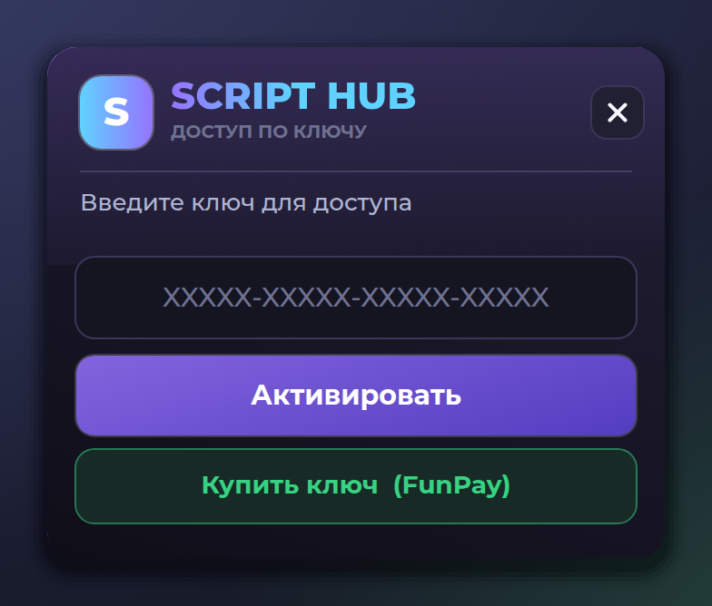

1. Вставь ключ в поле — формат `XXXXX-XXXXX-XXXXX-XXXXX`
2. Нажми **«Активировать»** — пока ключ проверяется, показывается экран **«ПРОВЕРКА КЛЮЧА»**
3. Ключа нет — жми **«Купить ключ (FunPay)»**: ссылка скопируется, открой её в браузере

Ключ запоминается: при следующих запусках окно активации пропускается, и сразу открывается меню.

> [!WARNING]
> **«Ключ привязан к другому аккаунту»** — ключ уже активирован на другом профиле. Зайди с того аккаунта, где активировал впервые, либо возьми новый ключ.

---

## 🛠️ Шаг 2. Настройка экзекутора

Скрипт постоянно телепортируется между лобби и матчами, поэтому в экзекуторе нужно **выключить** опцию **Verify Teleports**. Иначе скрипт застрянет в лобби.

<table>
<tr>
<td align="center"><b>❌ Неправильно</b> Verify Teleports включён</td>
<td align="center"><b>✅ Правильно</b> Verify Teleports выключен</td>
</tr>
<tr>
<td>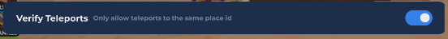</td>
<td>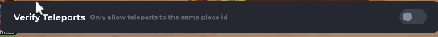</td>
</tr>
</table>

---

## 🚜 Шаг 3. Главное меню

После активации откроется меню **TDS FARM**.

  

| Плитка / кнопка | Что делает |
|---|---|
| 💎 **GEMS FARM** | запускает фарм гемов (клавиша `F1`) |
| 💰 **MONEY FARM** | запускает фарм денег (клавиша `F2`) |
| 🔴 **RECORDER** | открывает рекордер стратегий |
| ⚙️ шестерёнка | выбор башен, которые скрипт берёт в лобби |
| ✕ | закрыть меню |

Внизу — строка статуса: **«Готово к работе • F1 / F2»** либо список выбранных башен. Окно можно перетаскивать за заголовок.

---

## 🗼 Шаг 4. Выбор башен

Шестерёнка в заголовке открывает **НАСТРОЙКИ БАШЕН**. Здесь отмечаются башни, которые скрипт экипирует перед матчем.

  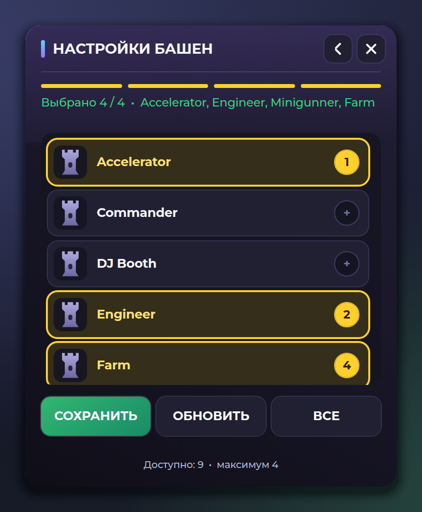

- Нажми на башню, чтобы взять её в слот. Номер в кружке — **порядок слота**, полоски сверху показывают, сколько слотов занято.
- Повторное нажатие снимает башню, номера остальных сдвигаются.

| Кнопка | Что делает |
|---|---|
| **СОХРАНИТЬ** | запомнить выбор (максимум **4** башни — столько слотов в игре) |
| **ОБНОВИТЬ** | перечитать инвентарь, если список пустой или устарел |
| **ВСЕ** / **ДОСТУПНЫЕ** | показать все башни игры или только твои |
| **<** | назад в меню |

> [!TIP]
> Список пуст или не сходится с игрой — открой в Roblox вкладку с башнями и нажми **ОБНОВИТЬ**. Если не помогло, кнопка **ПЕРЕЗАЙТИ В ИГРУ** сделает перезаход на сервер.

---

## 📊 Панель фарма и отчёты в Discord

После запуска режима откроется рабочая панель **TDS FARMER** с меткой режима — **GEMS** или **MONEY**.

<table>
<tr>
<td align="center"><b>GEMS</b></td>
<td align="center"><b>MONEY</b></td>
</tr>
<tr>
<td>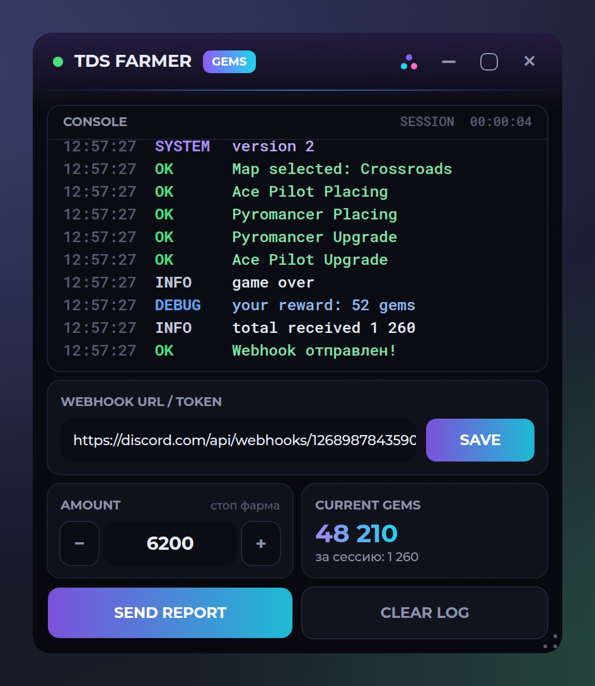</td>
<td>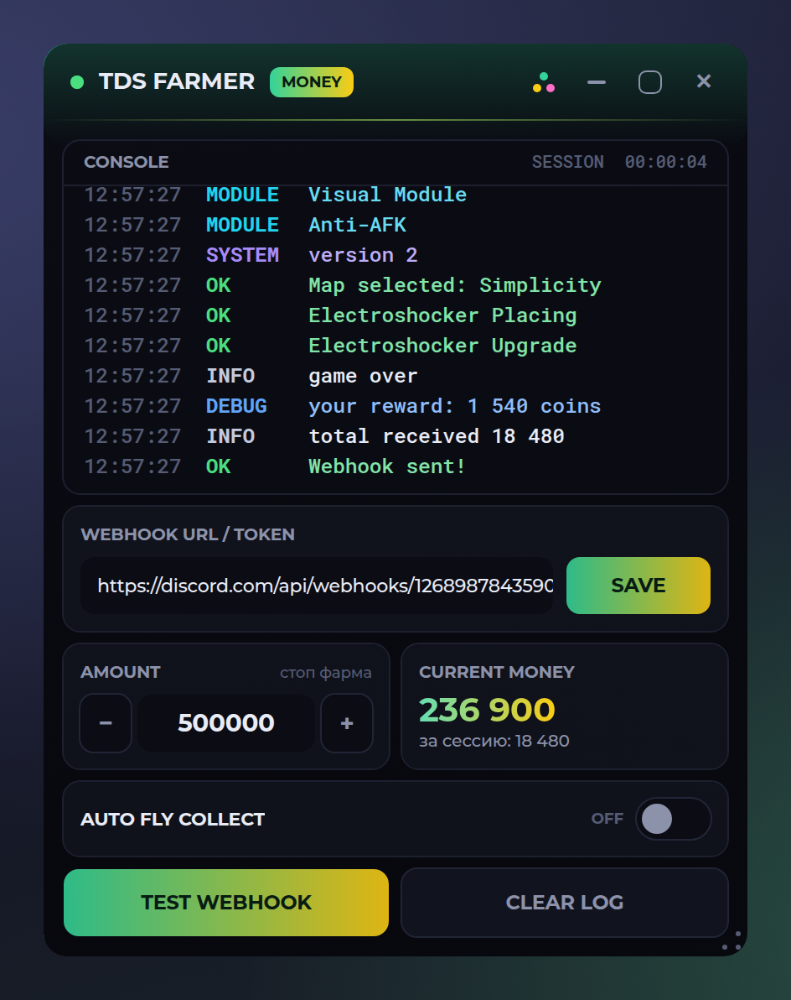</td>
</tr>
</table>

| Элемент | Описание |
|---|---|
| **CONSOLE** | журнал работы с временем и типом события; справа — время сессии |
| **WEBHOOK URL / TOKEN** | ссылка на Discord-вебхук. Вставь и нажми **SAVE** |
| **AMOUNT** | стоп-значение, кнопки **−** / **+** меняют его шагом. Скрипт остановится, когда наберёт это число. **Пусто (∞) = без лимита** |
| **CURRENT GEMS / MONEY** | текущий баланс и сколько нафармлено за сессию |
| **AUTO FLY COLLECT** | *(только MONEY)* сам собирает выпавшие на карте деньги |
| **SEND REPORT** / **TEST WEBHOOK** | отправить отчёт в Discord прямо сейчас |
| **CLEAR LOG** | очистить лог |

Кнопки в заголовке: 🎨 [палитра призраков](#ghosts), **—** свернуть, **▢** развернуть на весь экран, **✕** скрыть. Окно таскается за заголовок, а размер меняется за точки в правом нижнем углу.

**Свёрнутая панель.** Кнопка **—** превращает окно в компактную плашку: метка режима, баланс и время сессии. Развернуть — кнопкой **+** или просто тапом по плашке.

  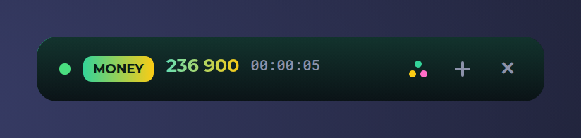

<b>Как получить ссылку вебхука Discord</b>

 

1. В своём Discord-сервере: **Настройки канала → Интеграции → Вебхуки → Новый вебхук**
2. Нажми **«Копировать URL вебхука»**
3. Вставь в поле **WEBHOOK URL / TOKEN** и нажми **SAVE**

Ссылка выглядит так: `https://discord.com/api/webhooks/...`

В отчёте будут баланс, заработок за сессию, время работы, ник, карта (при воспроизведении стратегии), время старта и полоска прогресса до лимита **AMOUNT**.

> [!CAUTION]
> Никому не давай эту ссылку — по ней можно писать в твой канал.

---

## 🔴 RECORDER — свои стратегии

Рекордер записывает **всё, что ты делаешь в матче**, а потом повторяет это сам — матч за матчем, бесконечно, пока не остановишь или пока не наберётся лимит из панели фарма.

  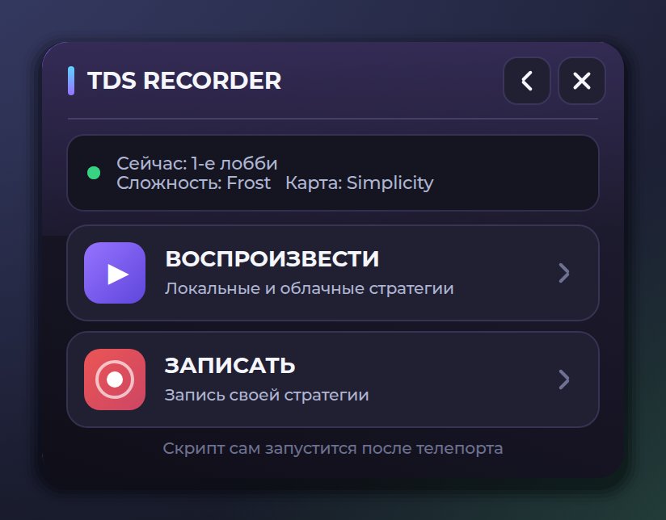

В карточке сверху видно, где ты сейчас (лобби или матч), какая сложность и карта запомнены. Кнопка **<** возвращает в главное меню.

**Что попадает в запись**

| Действие | Записывается |
|---|---|
| 🗼 постановка башни | место, поворот, номер башни |
| ⬆️ апгрейд | номер башни, путь, цена |
| 💰 продажа | номер башни |
| ✨ способность | номер башни и название |
| 🎯 смена цели | First / Last / Strongest и прочее |
| ⚙️ настройки башни | Flight Path, Unit 1 и другие списки |
| ⏩ скип волны | только если волна реально пропущена |

Вместе с действием запоминается **волна и секунда внутри неё** — при повторе всё выполняется в том же темпе.

---

### ● Запись стратегии

**1. Включи запись в 1-м лобби**

Открой рекордер и нажми **ЗАПИСАТЬ**.

  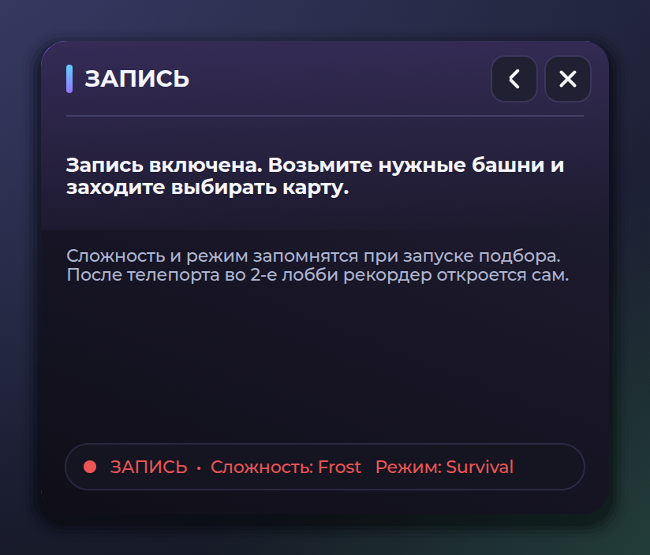

Дальше просто играй как обычно: возьми нужные башни и запусти поиск игры. Сложность и режим запомнятся сами (видно в строке **ЗАПИСЬ** внизу), а после телепорта во 2-е лобби рекордер **откроется заново сам**.

> [!NOTE]
> Передумал? Кнопка **<** снимает запись. Если ничего записать не успел, следов не останется.

**2. Выбери карту и играй**

Во 2-м лобби и в матче открывается **ЗАПИСЬ СТРАТЕГИИ**: каждое действие сразу появляется в логе вместе с волной, секундой и ценой. Пока идёт запись, в заголовке мигает метка **REC**.

  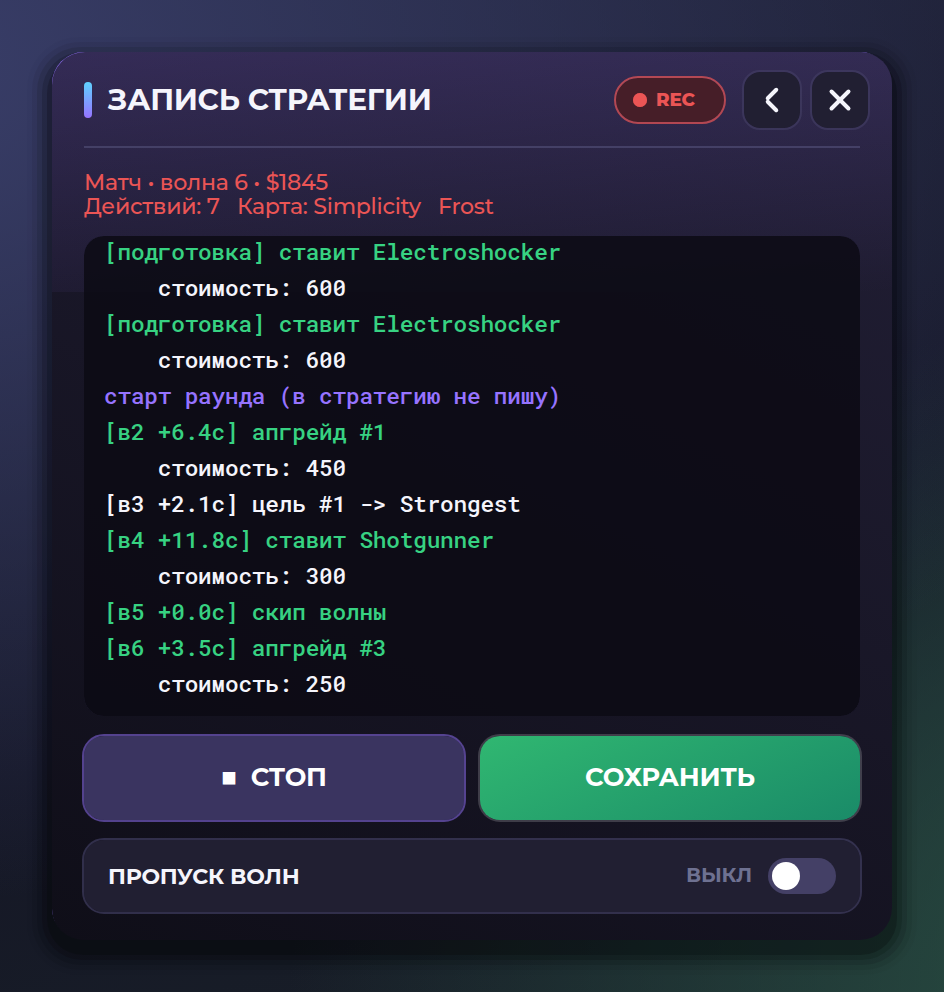

| Кнопка | Что делает |
|---|---|
| **■ СТОП** / **● ЗАПИСЬ** | приостановить и продолжить запись |
| **СОХРАНИТЬ** | ввести название и сохранить стратегию |
| **ПРОПУСК ВОЛН** | автоскип волн — матч идёт быстрее |

> [!TIP]
> Время **перед первой волной** («[подготовка]» в логе) не идёт: расставляй башни спокойно, порядок сохранится, а волна стартует только когда всё готово.

**3. Сохрани**

Нажми **СОХРАНИТЬ**, введи название — стратегия ляжет в память экзекутора. Там же кнопкой **В ОБЛАКО** её можно выложить для других владельцев ключей.

---

### ▶ Воспроизведение

Кнопка **ВОСПРОИЗВЕСТИ** в главном окне открывает список стратегий.

  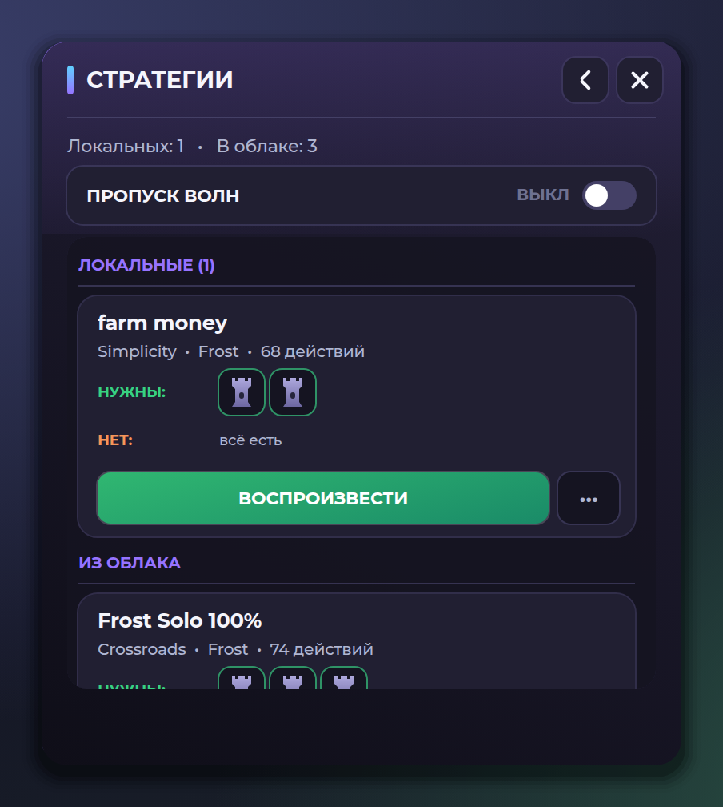

В карточке видно карту, сложность, число действий и башни:

- <b>НУЖНЫ</b> — башни, которые есть у тебя;
- <b>НЕТ</b> — которых не хватает. Наведи курсор на иконку — покажется название.

Переключатель **ПРОПУСК ВОЛН** над списком включает автоскип для прогона. Кнопка **•••** у своих стратегий открывает действия: **В ОБЛАКО** и **УДАЛИТЬ** (нажать дважды — защита от случайного клика).

> [!WARNING]
> Если каких-то башен нет, стратегия отыграется криво: пропущенные башни сдвинут нумерацию, и апгрейды уйдут не туда.

**Что делает скрипт при запуске**

1. берёт башни стратегии в 1-м лобби и запускает подбор с той же сложностью и режимом;
2. во 2-м лобби голосует за нужную карту (нет на досках — вето и заход заново);
3. на карте показывает **[призраков](#ghosts)** — полупрозрачные модели будущих башен с номерами, поставленная башня гасит своего призрака;
4. повторяет все действия по волнам и секундам;
5. дожидается исхода матча, шлёт отчёт в Discord и начинает круг заново.

Не хватает денег на башню — скрипт **ждёт, пока накопится**, и ставит её, как только хватит. Матч кончился досрочным поражением — прогон это видит и уходит на следующий круг.

Во время прогона вместо окна рекордера остаётся маленькая панель **ВОСПРОИЗВЕДЕНИЕ**, а весь ход пишется в [панель фарма](#panel): зелёным — что получилось, красным — что нет.

  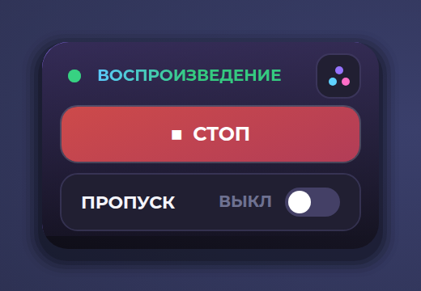

| Кнопка | Что делает |
|---|---|
| **■ СТОП** | остановить прогон (круги матчей бесконечны, пока не остановишь) |
| **ПРОПУСК** | включить или выключить автоскип волн прямо во время прогона |
| 🎨 | открыть [палитру призраков](#ghosts) |

---

### ☁️ Облако стратегий

Раздел **ИЗ ОБЛАКА** — стратегии других владельцев ключей.

  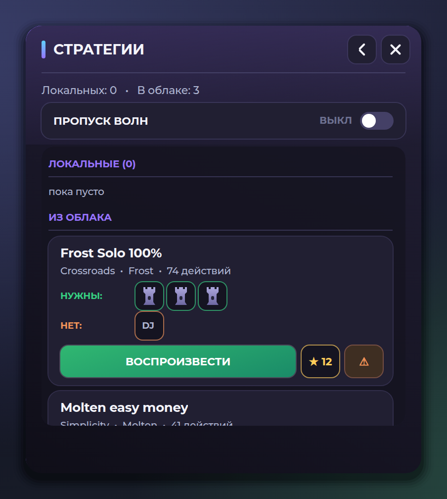

| Кнопка | Что делает |
|:--:|---|
| **ВОСПРОИЗВЕСТИ** | скачать и запустить стратегию |
| ★ | оценить. Повторное нажатие снимает голос |
| ⚠ | пожаловаться на стратегию (нажать **дважды** — защита от случайного клика) |

Жалобы видит автор скрипта: если на стратегию жалуются, её проверят и уберут из общего доступа.

---

## 👻 Призраки и палитра

Перед матчем скрипт показывает **призраков** — полупрозрачные копии башен на местах, где они встанут, с кругом под ними и номером сверху. Когда башня поставлена, призрак и круг гаснут, а номер становится зелёным.

Если на какой-то карте призраков плохо видно, открой **палитру** — кнопка 🎨 в заголовке панели фарма или на панели воспроизведения.

<table>
<tr>
<td align="center"><b>Вкладка «Призрак»</b></td>
<td align="center"><b>Вкладка «Круг»</b></td>
</tr>
<tr>
<td>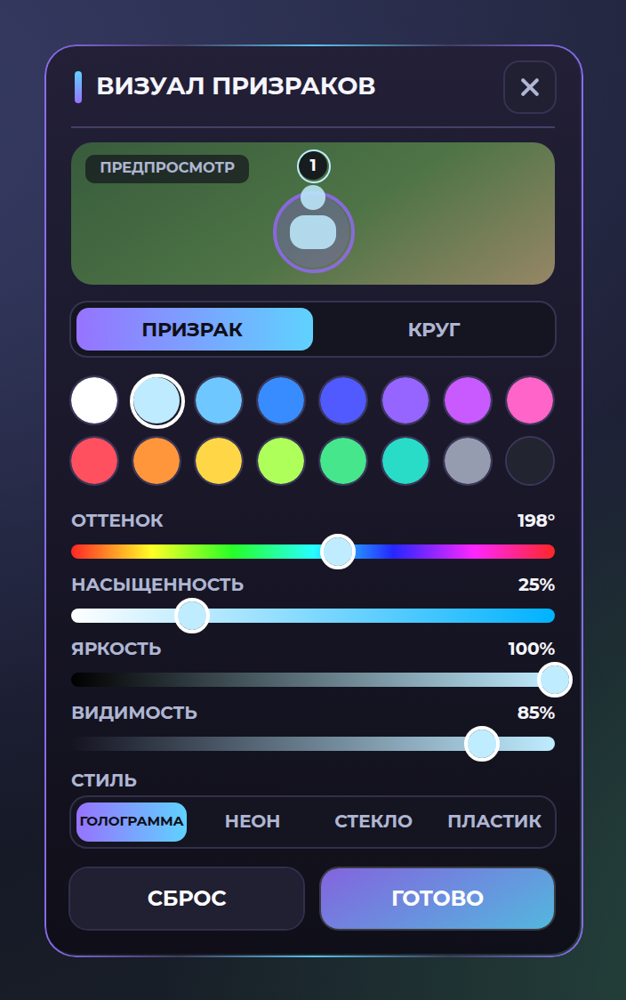</td>
<td>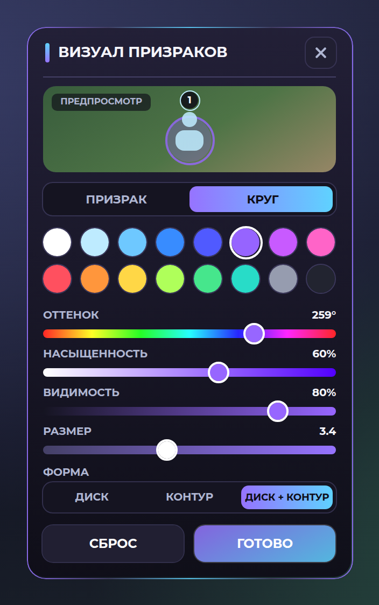</td>
</tr>
</table>

| Настройка | Призрак | Круг |
|---|---|---|
| **Цвет** | 16 готовых цветов + ползунки **оттенок**, **насыщенность**, **яркость** | 16 готовых цветов + **оттенок**, **насыщенность** |
| **Видимость** | насколько призрак прозрачный | насколько заметен круг (0% — круга нет) |
| **Стиль / форма** | голограмма, неон, стекло, пластик | диск, контур, диск + контур |
| **Размер** | — | диаметр круга |

- Сверху — **предпросмотр**: призрак на круге поверх «травы и песка», как на карте.
- Изменения сразу видны на всех призраках в матче. **СБРОС** возвращает цвета по умолчанию.
- Настройки сохраняются и не сбрасываются после телепорта.

> [!TIP]
> Призрак сливается с картой — переключи стиль на **НЕОН** или подними **ВИДИМОСТЬ**. Тормозит на стратегиях с десятками башен — выбери форму круга **ДИСК**.

---

## ❓ Частые вопросы

<b>Скрипт не заходит в матчи, застревает в лобби</b>

 

Проверь, что **Verify Teleports выключен** в настройках экзекутора (см. [Шаг 2](#executor)). Иногда дополнительно помогает VPN.

<b>«Ключ привязан к другому аккаунту»</b>

 

Ключ привязывается к аккаунту при первой активации. Зайди с того аккаунта, где активировал, либо возьми новый ключ.

<b>Как остановить фарм на нужном количестве?</b>

 

Впиши число в поле **AMOUNT** (или набери кнопками **−** / **+**). Пустое поле — фарм без лимита.

<b>Отчёты не приходят в Discord</b>

 

Проверь, что ссылка вебхука скопирована целиком и после вставки нажата **SAVE**. Проверить отправку — кнопкой **SEND REPORT** (гемы) или **TEST WEBHOOK** (деньги).

<b>Панель свернулась — как вернуть?</b>

 

Нажми **+** на плашке или просто тапни по ней. Если панель закрыта крестиком, она появится снова после следующего телепорта в матч или лобби.

<b>Список башен пустой</b>

 

Открой в игре вкладку с башнями (инвентарь) и нажми **ОБНОВИТЬ**. Если не помогло — **ПЕРЕЗАЙТИ В ИГРУ**.

<b>Рекордер не записывает действия</b>

 

Если в окне записи написано «Перехват действий недоступен в этом экзекуторе» — твой экзекутор не умеет перехватывать вызовы игры. Воспроизведение чужих стратегий при этом работает.

<b>При повторе башня не встаёт</b>

 

Две причины, обе видно в логе:

- **не хватает денег** — скрипт подождёт и поставит сам;
- **место занято** — обычно мешает башня другого игрока. Скрипт попробует несколько раз и пойдёт дальше.

<b>Призраков не видно или они сливаются с кругом</b>

 

Открой палитру (кнопка 🎨) и поменяй цвет круга или стиль призрака — см. [Призраки и палитра](#ghosts).

---

## ⚠️ Дисклеймер

Скрипт предназначен для ознакомительных целей. Использование сторонних скриптов нарушает условия использования Roblox и может привести к блокировке аккаунта. Используешь на свой страх и риск.

  TDS Farmer V2 · <a href="https://funpay.com/users/6883431/">купить ключ</a>

